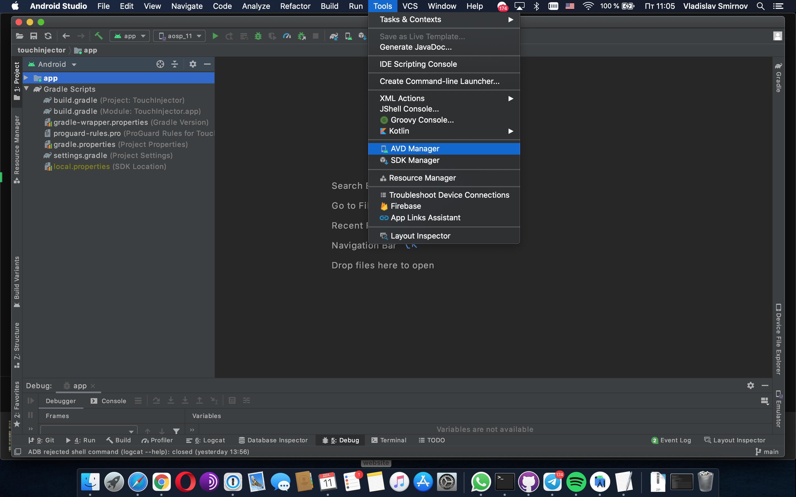
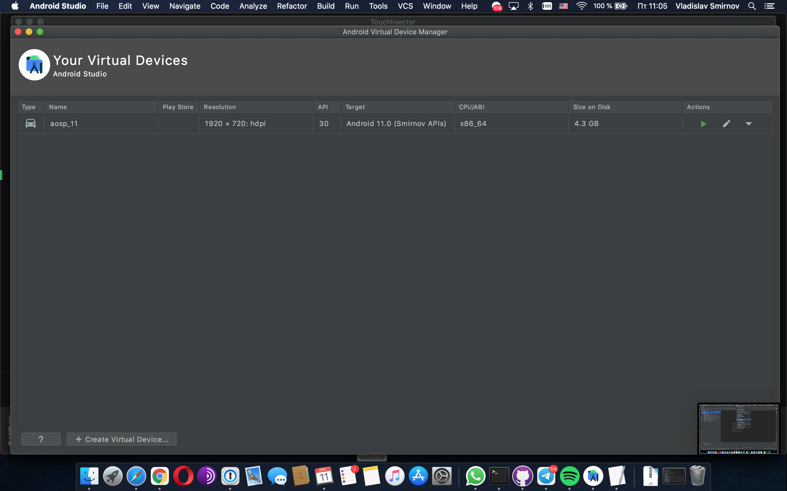
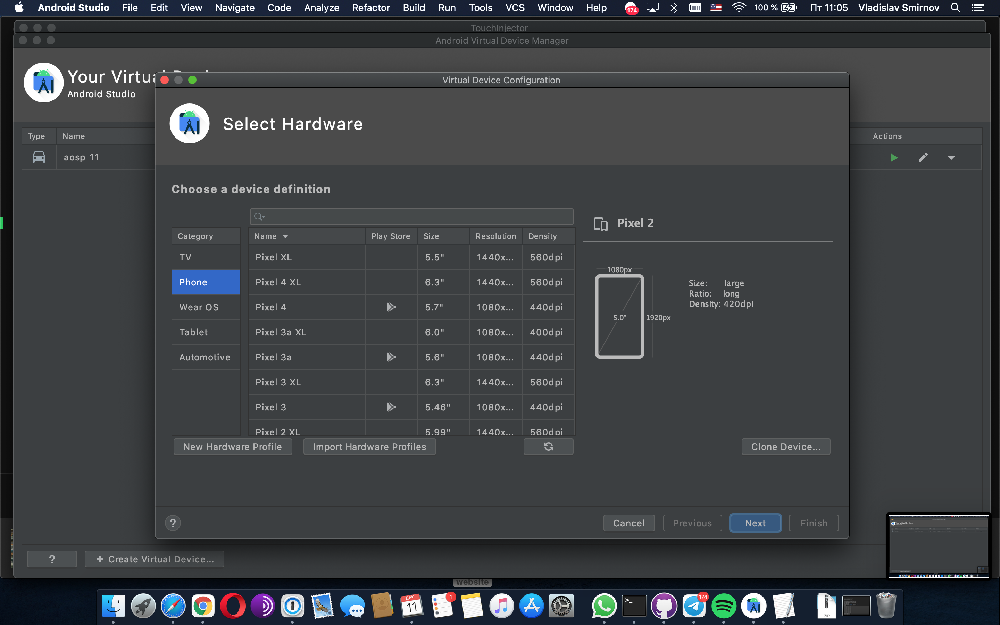
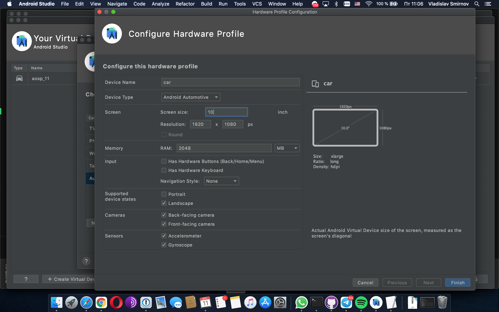

# Automotive AOSP Emulator

In this repo you can download binary files of avd for Android studio or standalone. I will describe hot to use it.

## How to

Let's start to work. 

Before the next step you should already have Android SDK and Android Studio.

##### Download zip archive
Use this [link](https://github.com/vladislav-smirnov/automotive-emulator-aosp/raw/main/aosp_11.zip) to download

##### Unpack zip archive

Unzip archive to <Android SDK path>/system-images/android-30. Result of that is aosp_11 folder into "android-30" folder.
 
  
##### Create avd
  I describe method for android studio. You can use different ways.
  
  1. Open Android Studio
  2. Open AVD manager 
  Menu  Tools -> AVD Manager
   
   
  3. Open Virtual device configuration.
  Press button "Create Virtual Device"
   
  4. Create New Hardware Profile
  - Put device name as you wish. example "car"
  - Choose device type: "Android Automotive"
  - Set screen size. It depends of your requrements. I recommend to set 10. 
  - Set resolution. I recommend 1920x1080.
  - Set Supported device states. I recommend choose only "Landscape".
     
  5. Create AVD 
  - Select HW.
  - Select System image
  - Finish avd creation. Don't forget to change avd name.
  
##### Start AVD
  To start AVD you can use Android studio or terminal(console).
  I use terminal. 
  - go to <Android SDK path>/emulator
  - start emulator by command ./emulator -avd <device name> -skin 1920x1080 -gpu on -verbose -debug-init -writable-system  -selinux permissive -no-snapshot
  
  Only few parameters are important 
  -writable-system 
  -avd <device name>

##### Wait when emulator will be opened. 

Result: 
 
    

For more details see [developes android](https://developer.android.com/studio/run/managing-avds).

## Root and remount

If you want to change anything on system partition you need to remount it.

use this commands:
- adb root
- adb shell avbctl disable-verification
- adb reboot
- adb root
- adb remount
